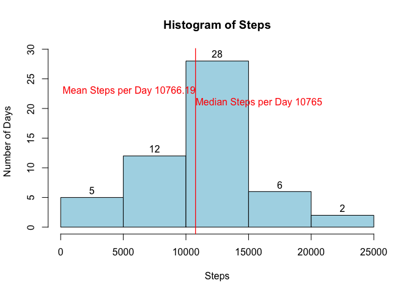
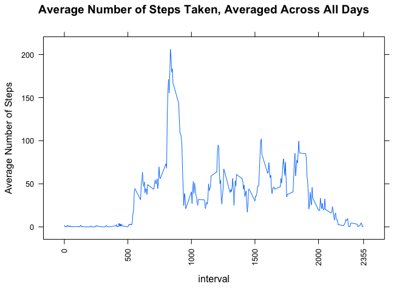
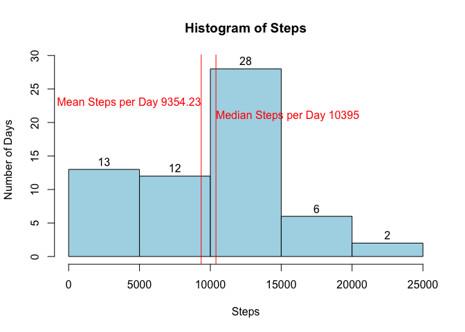
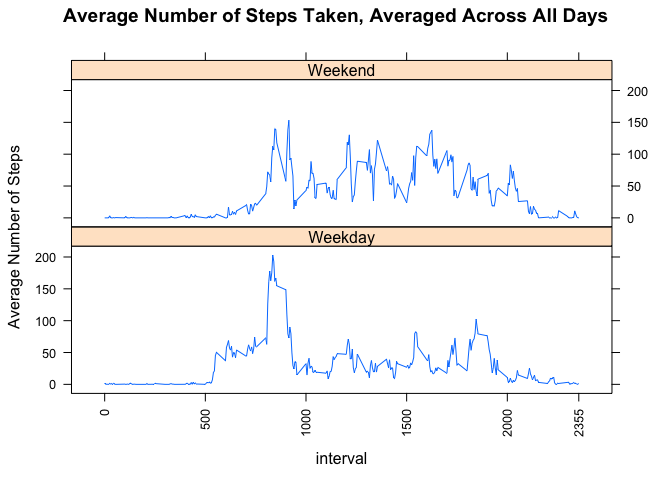

# Reproducible Research: Peer Assessment 1


## Loading and preprocessing the data
In this section, we read in the data file, NA's and all.


```r
activity <- read.csv("activity.csv")
```

Next, we create a histogram function, since we are printing more than one histogram. The function formats the mean to two places to keep things looking neat. We also plot two red vertical lines for the mean and median of the data set.


```r
# Create a histogram function
mkhist<-function(Steps) {  
    # Format the mean to two places so it looks nice when displayed
    StepsMean<-format(round(mean(Steps,na.rm=TRUE),2),nsmall=2)
    # Assign the histogram to r, as we use this later for placing the text
    r<-hist(Steps,ylab="Number of Days",col="lightblue",labels=TRUE,ylim = c(0, 29))
    # Draw 2 verticle lines for the mean and median
    # Note that we use "na.rm=TRUE" since we have left all the NAs
    # in place for later
    abline(v=mean(Steps,na.rm=TRUE),col=2)
    abline(v=median(Steps,na.rm=TRUE),col=2)
    # Write the mean and median on the plot as well
    text(mean(Steps,na.rm=TRUE),max(r$counts)-5, paste("Mean Steps per Day",StepsMean), adj = c(1, NA), col = 2)
    text(median(Steps,na.rm=TRUE),max(r$counts)-7, paste("Median Steps per Day",median(Steps,na.rm=TRUE)),adj = c(0, NA), col = 2)
}
```

## What is mean total number of steps taken per day?
Here, we calculate the sum of the number of steps for each day and make a histogram of the data.


```r
# Sum the total steps in each day
SumSteps<-tapply(activity$steps,activity$date,sum)
# Pass to the histogram function
mkhist(SumSteps)
```

 

Then calculate and print the mean and median total number of steps taken per day and print the results.


```r
print(paste("Mean number of steps per day is: ",mean(SumSteps,na.rm=TRUE)))
```

```
## [1] "Mean number of steps per day is:  10766.1886792453"
```

```r
print(paste("Median number of steps per day is: ",median(SumSteps,na.rm=TRUE)))
```

```
## [1] "Median number of steps per day is:  10765"
```

## What is the average daily activity pattern?
For this question, we make a time series line plot of the 5-minute interval on the x-axis and the average number of steps taken, averaged across all days on the y-axis. We load two libraries for the data manipulation and plots, **lattice,** and **dplyr.** The **dplyr** library is loaded with options to supress the warning messages that it changes certain functions.


```r
library(lattice)
library(dplyr,quietly=TRUE,warn.conflicts=FALSE)
# Here we use dplyr to prepare the data for plotting. 
# Specifically, group_by allows summarizing and calculating the mean number
# of steps in each interval
act_df<-tbl_df(activity)
daily<-group_by(act_df,interval)
myplot<-summarize(daily,meanSteps=mean(steps,na.rm=TRUE))
# We line-plot the mean number of steps vs. the interval
xyplot(meanSteps ~ interval, data = myplot,type="l", scales=list(x=list(at=c(0,500,1000,1500,2000,2355), rot=90)),ylab="Average Number of Steps",main="Average Number of Steps Taken, Averaged Across All Days")
```

 

Which 5-minute interval, on average across all the days in the dataset, contains the maximum number of steps? We use the **which.max** function to find that value.


```r
print(paste("Five-minute interval, on average, with the maximun steps:",myplot[which.max(myplot$meanSteps),1]))
```

```
## [1] "Five-minute interval, on average, with the maximun steps: 835"
```

## Imputing missing values
There are a number of days/intervals where there are missing values (coded as `NA`). The presence of missing days may introduce bias into some calculations or summaries of the data. Calculate and report the total number of missing values in the dataset (i.e. the total number of rows with `NA`).


```r
print(paste("Total number of rows with NAs:",sum(is.na(activity))))
```

```
## [1] "Total number of rows with NAs: 2304"
```

Devise a strategy for filling in all of the missing values in the dataset. The strategy does not need to be sophisticated. For example, you could use the mean/median for that day, or the mean for that 5-minute interval, etc.

To create a new dataset that is equal to the original dataset but with the missing data filled in, we use **dplyr** functions again, specifically **group_by** and **mutate_each**. There are still some rows with the entire day as `NA` and end up with `NaN`. We use **replace** to change these to zero.


```r
act_df<- act_df %>%
    group_by(date,interval) %>%
    mutate_each(funs(mean=mean(., na.rm=TRUE)), contains("."))
# change the NaN to 0
act_df$steps<-replace(act_df$steps,is.nan(act_df$steps),0)
```

We again make a histogram of the total number of steps taken each day and calculate and report the mean and median total number of steps taken per day. 


```r
#Sum the total steps in each day
Steps_all<-tapply(act_df$step,act_df$date,sum)
mkhist(Steps_all)
```

 

```r
print(paste("Mean number of steps per day is: ",mean(Steps_all)))
```

```
## [1] "Mean number of steps per day is:  9354.22950819672"
```

```r
print(paste("Median number of steps per day is: ",median(Steps_all)))
```

```
## [1] "Median number of steps per day is:  10395"
```

Do these values differ from the estimates from the first part of the assignment? **Yes**

What is the impact of imputing missing data on the estimates of the total daily number of steps? **By adding in intervals with zeros, the data gets pulled to the left, lowering the mean and median.** 


## Are there differences in activity patterns between weekdays and weekends?
Next, we create a new factor variable in the dataset with two levels – “weekday” and “weekend” indicating whether a given date is a weekday or weekend day. We convert the `date` column from character to a date using **as.date**. Then use the **weekday** function to calculate the day of the week. 


```r
act_df$date<-as.Date(act_df$date,"%Y-%m-%d")
act_df$date<-weekdays(act_df$date)
```

We then use **grep** and **replace** to change the column to weekend or weekday as appropriate.


```r
act_df$date<-replace(act_df$date,grep("Sunday|Saturday",act_df$date),"Weekend")
act_df$date<-replace(act_df$date,grep("Weekend",act_df$date,invert=TRUE),"Weekday")
```

We next make a panel plot containing a time series line plot of the 5-minute interval (x-axis) and the average number of steps taken, averaged across all weekday days or weekend days (y-axis). Again, we use **group_by** and **summarize** to build the plot. 


```r
dow<-group_by(act_df,date,interval)
myplot<-summarize(dow,mean=mean(steps))
```

The difference with **xyplot** from the first plot is that we condition the mean and interval with the date, a bivariate that is either `weekend` or `weekday`.


```r
xyplot(mean ~ interval| date,data = myplot,type="l", layout=c(1,2), scales=list(x=list(at=c(0,500,1000,1500,2000,2355), rot=90)),ylab="Average Number of Steps",main="Average Number of Steps Taken, Averaged Across All Days")
```

 

Notice the difference in the weekend vs. weekday activity. Weekends tend to have the average number of steps spread troughout the day, while Weekdays have more steps earlier in the day. This would be consistant with someone who works at a sedintary job during the week and either walks to work, or tries to get a workout in before work.
